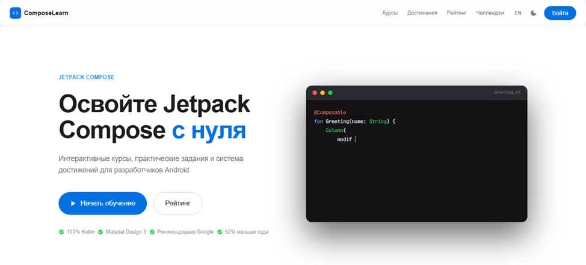
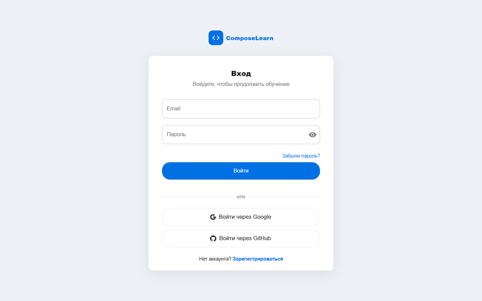
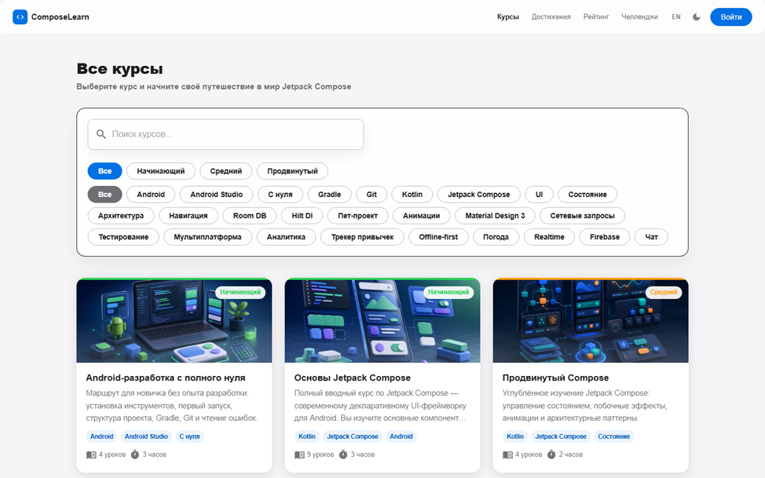
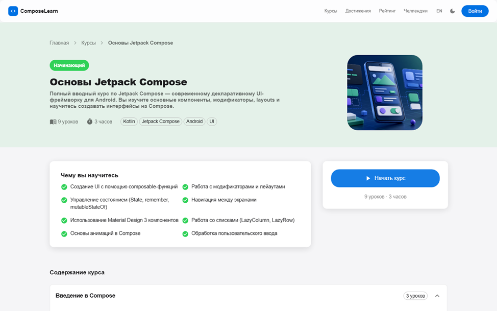
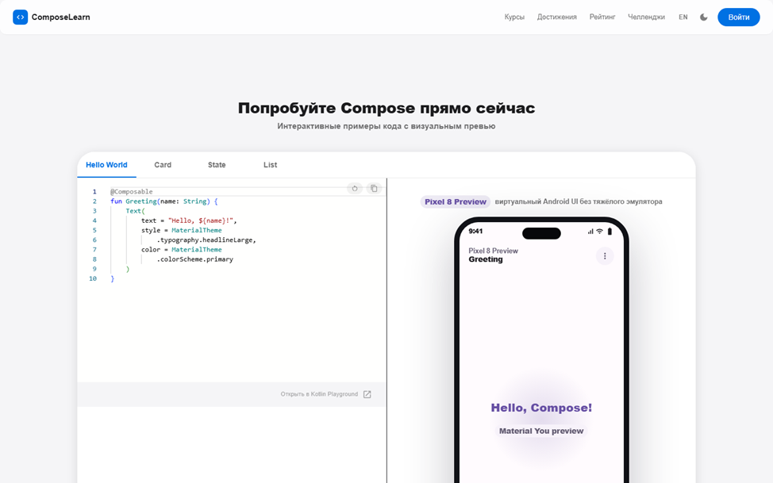

# План демонстрации программного продукта ComposeLearn

> Дата подготовки: 22.05.2026
> Демонстрируемый продукт: веб-ресурс ComposeLearn для изучения разработки мобильных приложений с использованием Jetpack Compose.
> Публичный адрес: https://composelearn.ru

## 1. Цель демонстрации

Показать, что разработанный программный продукт готов к использованию: пользователь может открыть веб-ресурс, зарегистрироваться или войти, выбрать курс, изучить урок, выполнить практическое задание, увидеть прогресс, достижения и сертификат. Дополнительно демонстрируется административный раздел для управления пользователями, курсами и уроками.

## 2. Аудитория демонстрации

- преподаватель или комиссия, оценивающая выпускную работу;
- потенциальный пользователь учебной платформы;
- администратор, отвечающий за сопровождение учебного контента.

## 3. Подготовка перед демонстрацией

Перед началом показа необходимо выполнить короткую техническую проверку:

- открыть сайт `https://composelearn.ru`;
- проверить, что главная страница загружается без ошибок;
- проверить healthcheck API: `https://composelearn.ru/api/health`;
- подготовить тестовую учетную запись пользователя;
- подготовить учетную запись администратора;
- открыть браузер в обычном desktop-размере, при необходимости также подготовить мобильный режим DevTools;
- убедиться, что интернет-соединение стабильно;
- закрыть лишние вкладки и приложения, которые могут мешать демонстрации.

## 4. Сценарий демонстрации

### 4.1. Вступление

Кратко представить назначение продукта:

ComposeLearn - это интерактивная обучающая платформа для изучения Jetpack Compose. Система объединяет каталог курсов, страницы уроков, практические задания, playground, отслеживание прогресса, достижения, сертификаты и административный раздел.

Ориентировочное время: 1-2 минуты.

### 4.2. Главная страница

Показать:

- общий вид веб-ресурса;
- навигацию;
- переход к каталогу курсов;
- адаптивность интерфейса при изменении ширины экрана.

Что подчеркнуть:

- интерфейс выполнен как готовый пользовательский продукт;
- основные разделы доступны из навигации;
- сайт опубликован на production-домене.

Ориентировочное время: 2 минуты.

### 4.3. Регистрация и вход

Показать один из вариантов:

- регистрацию нового пользователя;
- вход через существующую учетную запись;
- вход через Google или GitHub, если требуется показать OAuth.

Что подчеркнуть:

- система поддерживает пользовательские учетные записи;
- защищенные разделы доступны после авторизации;
- ошибки формы обрабатываются на стороне интерфейса.

Ориентировочное время: 2-3 минуты.

### 4.4. Каталог курсов

Показать:

- список доступных курсов;
- карточки курсов с обложками;
- поиск или фильтрацию;
- переход на страницу выбранного курса.

Рекомендуемый курс для демонстрации: базовый курс по Jetpack Compose, так как он понятен аудитории и хорошо показывает основной учебный сценарий.

Что подчеркнуть:

- в системе размещен набор опубликованных курсов;
- карточка курса содержит краткое описание и визуальную обложку;
- пользователь может быстро выбрать подходящий курс.

Ориентировочное время: 3 минуты.

### 4.5. Страница курса

Показать:

- описание курса;
- структуру уроков;
- информацию о сложности и продолжительности;
- переход к первому или выбранному уроку.

Что подчеркнуть:

- курс представлен как последовательная образовательная траектория;
- пользователь видит, из каких уроков состоит обучение;
- структура курса подходит для самостоятельного прохождения.

Ориентировочное время: 2 минуты.

### 4.6. Страница урока

Показать:

- теоретический материал;
- блок разбора кода;
- практическую часть;
- критерии готовности или самопроверку;
- отметку о выполнении урока.

Что подчеркнуть:

- урок содержит не только текст, но и практическое объяснение кода;
- материал локализован и адаптирован под учебную задачу;
- прогресс пользователя сохраняется в системе.

Ориентировочное время: 5 минут.

### 4.7. Playground

Показать:

- переход в раздел `/playground`;
- работу с примером кода или учебным заданием;
- переключение вкладок/режимов, если это уместно для текущего сценария.

Что подчеркнуть:

- раздел предназначен для практического закрепления материала;
- пользователь может экспериментировать с кодом в рамках учебной платформы;
- playground дополняет теоретические уроки.

Ориентировочное время: 3 минуты.

### 4.8. Профиль, прогресс и достижения

Показать:

- страницу профиля;
- прогресс по курсам;
- достижения;
- leaderboard, если нужно показать элемент мотивации.

Что подчеркнуть:

- система фиксирует результаты обучения;
- пользователь видит личный прогресс;
- достижения повышают вовлеченность.

Ориентировочное время: 3 минуты.

### 4.9. Сертификат

Показать:

- раздел сертификатов;
- доступность сертификата после выполнения условий курса;
- общий вид страницы сертификата.

Что подчеркнуть:

- итог обучения имеет понятный результат;
- сертификат связан с прохождением курса;
- функциональность готова для демонстрации полного учебного цикла.

Ориентировочное время: 2 минуты.

### 4.10. Административный раздел

Показать вход под администратором и основные страницы:

- dashboard;
- users;
- courses;
- lessons;
- создание или редактирование урока, если демонстрация предусматривает изменение данных.

Что подчеркнуть:

- система имеет отдельный административный контур;
- контент можно сопровождать без прямой работы с базой данных;
- права пользователя и администратора разделены.

Ориентировочное время: 4-5 минут.

### 4.11. Техническая часть

Кратко показать или озвучить архитектуру:

- frontend: Next.js, React, TypeScript, MUI;
- backend: Express, TypeScript, Prisma;
- база данных: PostgreSQL;
- Redis используется для кэша и rate limiting;
- Docker Compose применяется для production-развертывания;
- Nginx обслуживает публичный HTTPS-доступ;
- observability-контур включает Prometheus, Grafana, Loki и системные метрики.

Что подчеркнуть:

- приложение развернуто как полноценный web/API stack;
- база данных и Redis не опубликованы наружу;
- публично доступны только необходимые HTTP/HTTPS endpoints.

Ориентировочное время: 3 минуты.

### 4.12. Завершение демонстрации

Подвести итог:

- продукт опубликован и доступен по домену;
- реализован полный пользовательский путь от выбора курса до результата обучения;
- есть административные инструменты для сопровождения;
- выполнены проверки production-готовности: QA, OAuth, backup restore, monitoring, healthcheck.

Ориентировочное время: 1-2 минуты.

## 5. Рекомендуемый тайминг

| Этап | Время |
| --- | ---: |
| Вступление | 1-2 мин |
| Главная страница | 2 мин |
| Авторизация | 2-3 мин |
| Каталог и страница курса | 5 мин |
| Урок и playground | 8 мин |
| Профиль, достижения, сертификат | 5 мин |
| Административный раздел | 4-5 мин |
| Техническая часть | 3 мин |
| Итог | 1-2 мин |

Общее время: примерно 30 минут. При ограничении по времени демонстрацию можно сократить до 12-15 минут, оставив главную страницу, каталог, урок, playground, прогресс и краткий показ админ-раздела.

## 6. Короткий сценарий на 12-15 минут

Если времени мало, использовать такой порядок:

1. Открыть `https://composelearn.ru` и кратко описать назначение продукта.
2. Перейти в каталог курсов.
3. Открыть базовый курс по Jetpack Compose.
4. Открыть урок и показать теорию, разбор кода и практику.
5. Отметить урок выполненным.
6. Открыть playground.
7. Показать профиль/прогресс/достижения.
8. Показать сертификаты.
9. Войти в административный раздел и открыть страницы курсов/уроков.
10. Завершить техническим резюме: production-домен, API, PostgreSQL, Docker, Nginx, мониторинг.

## 7. Возможные вопросы и ответы

**Какая основная задача продукта?**
Помочь пользователю изучать Jetpack Compose через структурированные курсы, уроки, практические задания и отслеживание прогресса.

**Почему выбран web-формат?**
Web-ресурс доступен без установки приложения и удобен для самостоятельного обучения с разных устройств.

**Какие роли есть в системе?**
Посетитель, зарегистрированный пользователь и администратор.

**Что делает администратор?**
Управляет пользователями, курсами и уроками через отдельный административный интерфейс.

**Как хранится прогресс?**
Прогресс связан с учетной записью пользователя и сохраняется на backend-стороне.

**Какие технологии использованы?**
Next.js, React, TypeScript, MUI, Express, Prisma, PostgreSQL, Redis, Docker Compose, Nginx.

**Готов ли продукт к эксплуатации?**
Да, v1.0 развернут на production-домене, основные пользовательские сценарии и инфраструктурные проверки выполнены.

## 8. Риски во время демонстрации и резервный план

| Риск | Что сделать |
| --- | --- |
| Нестабильный интернет | Использовать заранее подготовленные скриншоты ключевых экранов |
| Ошибка входа в тестовую учетную запись | Использовать резервную учетную запись |
| OAuth недоступен из-за внешнего провайдера | Показать обычный login/register |
| Production кратковременно недоступен | Показать подготовленные скриншоты и локальную архитектуру |
| Не хватает времени | Перейти на короткий сценарий из раздела 6 |

## 9. Чек-лист готовности

- [ ] Сайт `https://composelearn.ru` открывается.
- [ ] `/api/health` возвращает успешный ответ.
- [ ] Подготовлена пользовательская учетная запись.
- [ ] Подготовлена административная учетная запись.
- [ ] Проверен переход в каталог курсов.
- [ ] Проверен переход на страницу курса.
- [ ] Проверен переход на страницу урока.
- [ ] Проверен playground.
- [ ] Проверены профиль, прогресс и достижения.
- [ ] Проверена страница сертификатов.
- [ ] Проверен административный раздел.
- [ ] Подготовлен короткий сценарий на случай ограничения времени.
- [ ] Подготовлены скриншоты или PDF-материалы на случай технических сбоев.
